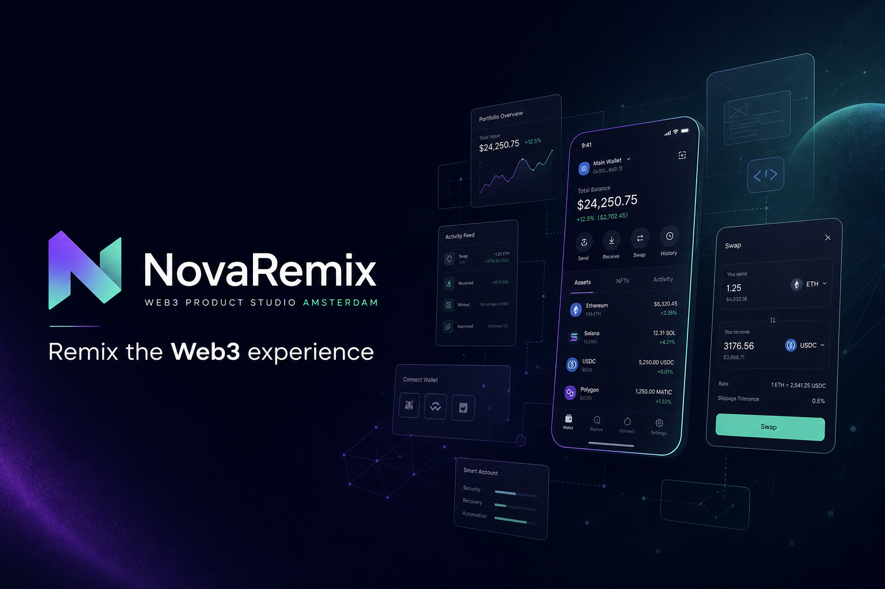
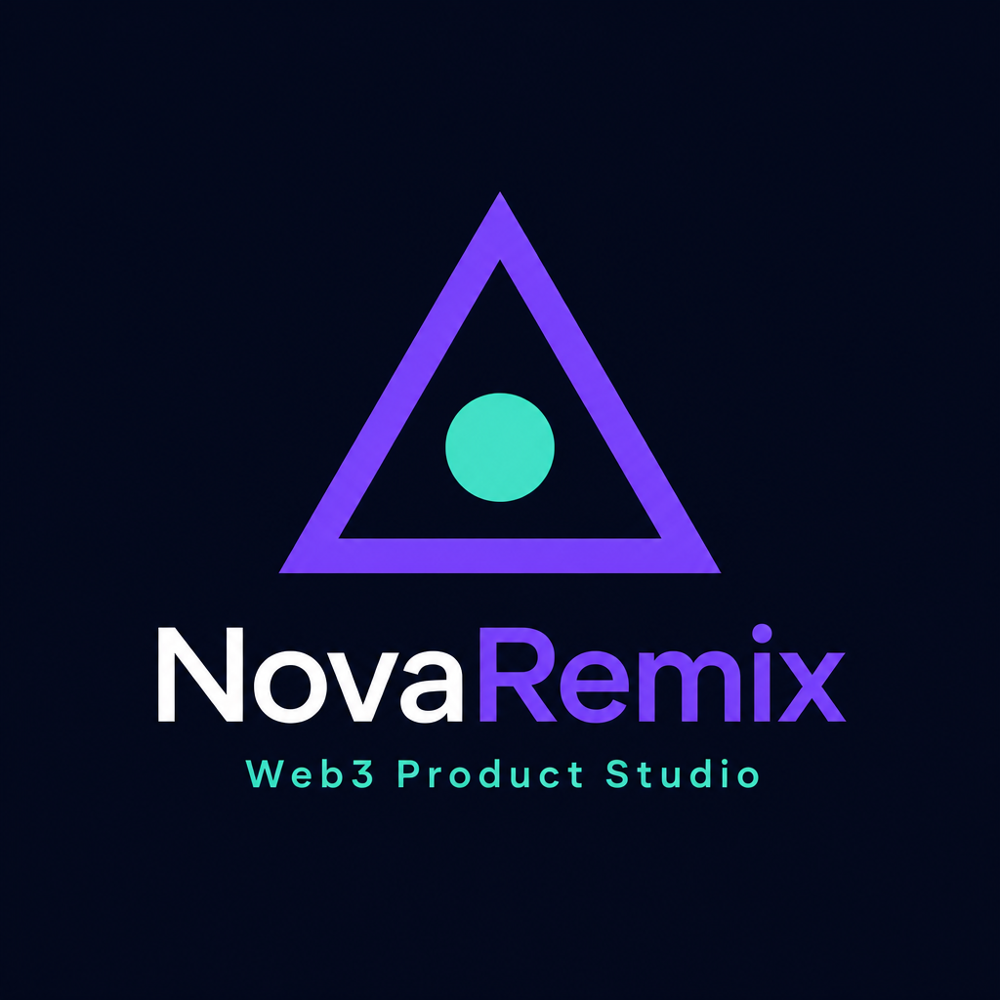

<!-- 

 -->

<h1 align="center">MexoForge</h1>

<strong>Forging on-chain infrastructure</strong>

<em>Blockchain infrastructure forge · San Francisco, CA</em>

  
  
  

  
  
  
  

## About
**MexoForge** engineers production blockchain infrastructure — custom indexers, MEV protection layers, rollup integrations, token launch systems, protocol migrations, and institutional custody gateways.

## Capabilities
| Practice | Deliverables |
|----------|-------------|
| **On-Chain Indexing** | Reorg-safe pipelines, GraphQL/REST APIs, monitoring |
| **MEV Protection** | Private relays, bundle simulation, operator dashboards |
| **Rollup & L2** | Bridge modules, sequencer health monitors, pause hooks |
| **Token Launch** | Launch sequencing, liquidity routing, vesting consoles |
| **Protocol Migration** | Upgrade paths, state migration, dual-run validation |
| **Custody Gateways** | Permissioned deposits, KYC gates, compliance APIs |

## Stack
Solidity · Foundry · Rust · Node.js · TypeScript · PostgreSQL · Flashbots · Optimism · Arbitrum

## Selected Client Work
| Project | Category |
|---------|----------|
| Helix Oracle Indexer | Indexing |
| Rampart MEV Shield | MEV |
| Strata Rollup Console | L2 |
| Ember Launchpad Desk | Launch |
| Copernicus Migration Desk | Migration |
| Bastion Custody Gateway | Custody |

[View all work →](https://mexoforge.com/work)

## Work With Us

  
  

<strong>MexoForge</strong> · San Francisco · <a href="https://mexoforge.com">mexoforge.com</a>

